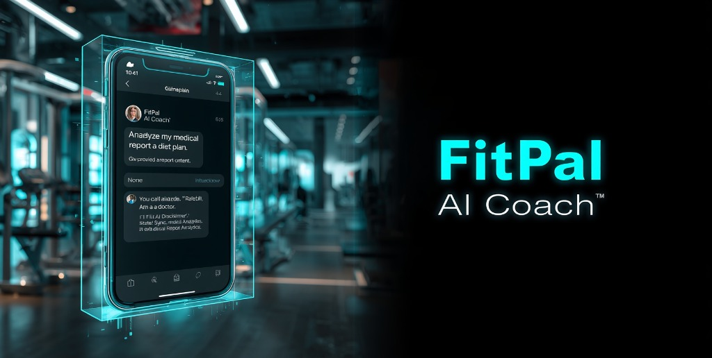
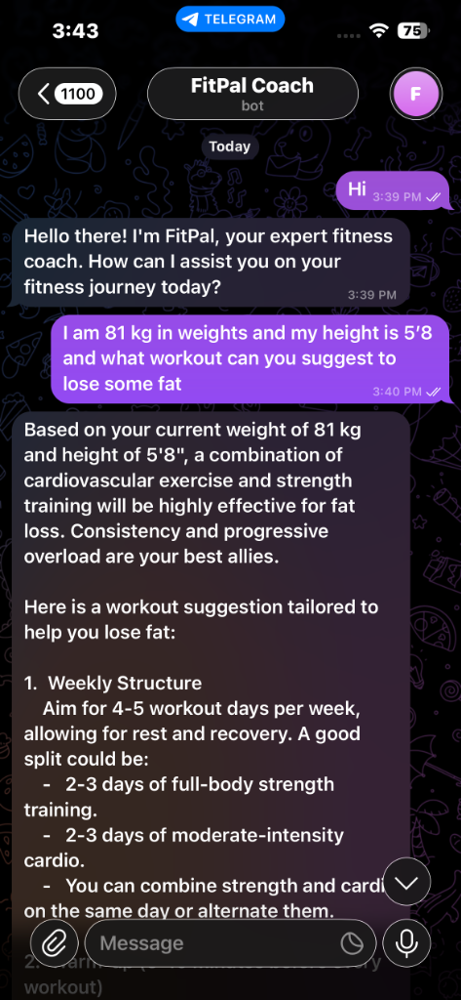
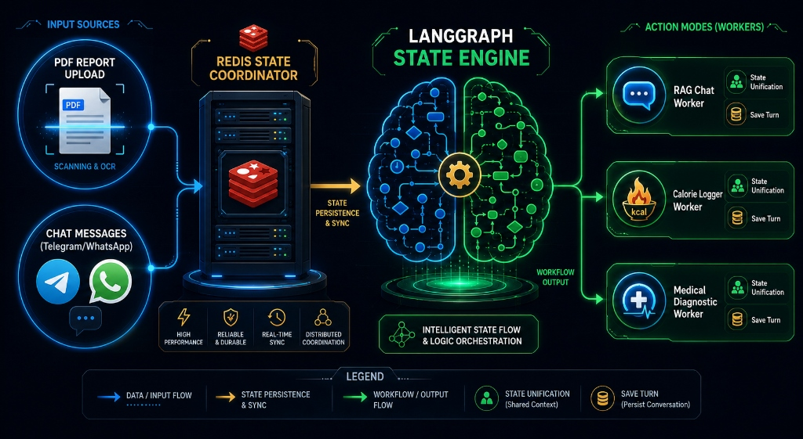
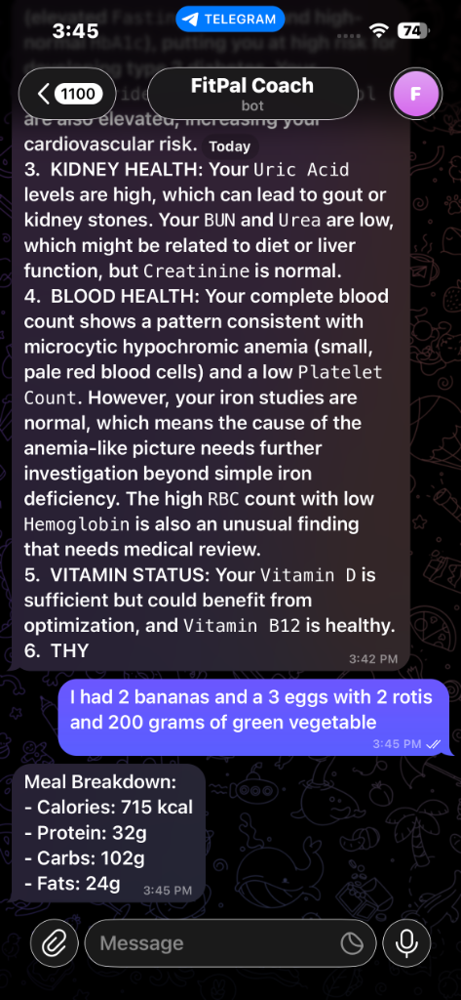
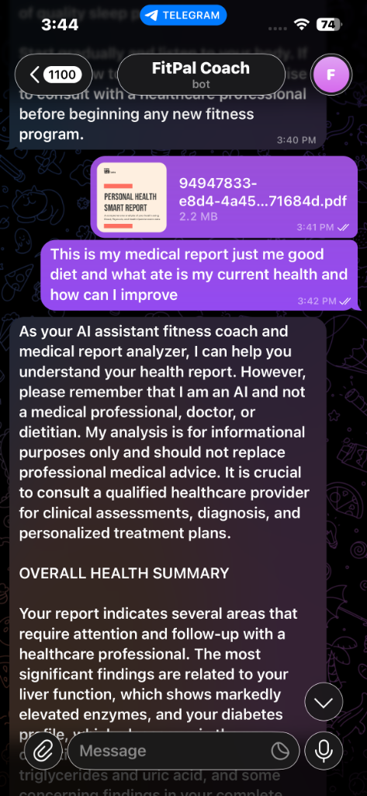

<div align="center">

# 🏋️ FitPal AI Coach — Backend Engine



<br/>

<!-- Platform Badges -->
<a href="https://t.me/your_bot_username">
  
</a>
<a href="#">
  
</a>


<br/><br/>

<!-- Core Tech Stack Icons -->


<br/><br/>

<!-- Detailed Tech Badges -->


<br/><br/>

---

*A production-grade, stateful AI coaching engine distributing personalized fitness, nutrition, and medical report analytics across  and  messaging channels.*

---

</div>

## 📌 Table of Contents

- [System Overview](#-system-overview)
- [Technology Stack](#️-unified-system-technology-stack)
- [Architecture Pillars](#️-core-architectural-pillars)
- [Project Structure](#-project-directory-structure)
- [LangGraph Pipeline](#-langgraph-state-machine-pipeline)
- [Security & DevSecOps](#-security--devsecops-layout)
- [Local Development Setup](#-local-development-setup)
- [API Reference](#-api-endpoint-reference)
- [Webhook Channel Map](#-webhook-channel-architecture)
- [Production Dependency Manifest](#-production-dependency-manifest)
- [Screenshots](#-live-system-screenshots)

---

## 🧭 System Overview

FitPal AI Coach is a multi-channel, stateful conversational AI backend engineered for real-world fitness coaching deployments. Users interact through <code>Telegram</code> and <code>WhatsApp</code> to receive personalized workout advice, precision macro nutrition estimates, and deep-dive clinical laboratory report analytics — all powered by a deterministic <code>LangGraph</code> execution graph routing through <code>Google Gemini 2.5 Flash</code>.
The architecture is designed around three non-negotiable production principles: zero-latency webhook ingestion, cryptographically safe secret management, and diskless document extraction to protect sensitive user health data at every stage.

---

## 🛠️ Unified System Technology Stack

| Architecture Component | Technology Stack | Core Processing Responsibility |
| :--- | :--- | :--- |
| <code>API Webhook Gateway</code> | <code>FastAPI</code> / <code>Uvicorn</code> | High-throughput, non-blocking asynchronous payload ingestion with instant <code>200 OK</code> handshakes. |
| <code>Stateful Graph Router</code> | <code>LangGraph</code> / <code>LangChain</code> | Deterministic multi-node intent routing, state unification, and turn-level execution flows. |
| <code>Session Cache Store</code> | <code>Redis DB</code> (Port <code>6379</code>) | Ephemeral request synchronization and persistent multi-turn message history storage per <code>session_id</code>. |
| <code>Document Extraction</code> | <code>PyMuPDF</code> (<code>Fitz Engine</code>) | Low-overhead, memory-safe direct binary RAM byte-stream PDF processing with zero disk writes. |
| <code>Intelligence Model</code> | <code>Google Gemini 2.5 Flash</code> | Advanced context extraction, intent classification, and structured responsive coaching output. |
| <code>Vector Search Index</code> | <code>FAISS</code> / <code>HuggingFace</code> | High-speed local semantic similarity retrieval for RAG knowledge base queries. |
| <code>Tunnel Gateway</code> | <code>LocalTunnel</code> | Secure HTTPS public endpoint exposure for active webhook registration during development. |

---

## ⚙️ Core Architectural Pillars

### 📡 FastAPI Asynchronous Router Layout

The backend leverages a modular router blueprint designed to handle high-concurrency mobile streaming webhooks. Inbound data requests from messaging platforms are parsed instantly; any long-running transactions (such as downloading <code>2MB+</code> lab reports or running multi-page PDF extractions) are immediately offloaded to <code>BackgroundTasks</code> threads. This ensures the main server loops return an instant <code>200 OK</code> connection handshake back to the external platform gateways, mitigating packet drops or duplicate retry triggers from platform delivery systems.

<div align="center">

<br/>
<em>FitPal responding to a live fitness query on Telegram — general chat routing in action.</em>
</div>

---

### 🔮 LangGraph Deterministic State Management

The system's reasoning center is structured around a <code>StateGraph</code> execution pipeline compiled once at server startup and reused across all transactions. Each conversational turn undergoes a strict multi-node evaluation lifecycle:
- <code>Intent Classification Node</code>: Uses <code>llm.with_structured_output()</code> to precisely isolate whether a user intends to log nutritional calories, seek general training advice, or request clinical lab record tracking.
- <code>Specialized Worker Nodes</code>: Routes dynamically based on state classification variables into isolated processors — RAG chat nodes, macro-estimation parsers, or medical analysis engines.
- <code>State Unification Layer</code>: Normalizes language model outputs under strict HTML styling rules and commits the full turn to <code>RedisChatMessageHistory</code> before graph exit.

<div align="center">

<br/>
<em>Full LangGraph State Engine — PDF inputs, Redis coordination, intent routing, and three specialized worker nodes.</em>
</div>

---

### 💾 Redis Ephemeral Caching Coordination Engine

State synchronization relies on a high-performance <code>Redis</code> memory cache layer running on <code>localhost:6379</code>. Messaging applications like <code>Telegram</code> distribute media file uploads and their accompanying text captions as separate, non-simultaneous webhook events. To counteract this data fragmentation, <code>Redis</code> acts as a stateful staging area. It caches whichever event segment arrives first for up to <code>60 seconds</code>. The moment both the <code>pdf_cache_key</code> and <code>msg_cache_key</code> slots are populated, the background thread merges the prompt string and the extracted file text perfectly before invoking the <code>LangGraph</code> engine. Successful reconciliation triggers an immediate key deletion to reset the staging bucket for the next turn.

<div align="center">

<br/>
<em>Multi-turn session — medical report analysis followed by an instant calorie log request, both handled in the same session context.</em>
</div>

---

### 🧠 Memory-Safe PyMuPDF Data Streaming

Document processing uses a diskless, RAM-first extraction pipeline. Rather than dumping user health files to the server's local hard drive, the system streams raw document binaries straight into memory arrays via <code>httpx.AsyncClient</code>. The <code>PyMuPDF</code> (<code>fitz</code>) engine parses the text layers instantly from memory using <code>fitz.open(stream=pdf_bytes, filetype="pdf")</code> and passes the extracted string directly into the <code>LangGraph</code> context window. The temporary memory arrays are then flushed immediately — entirely bypassing local storage I/O limits, removing file deletion maintenance tasks, and securing sensitive user health data.

<div align="center">

<br/>
<em>User uploads a 2.2MB Personal Health Smart Report PDF via Telegram — FitPal performs a full clinical analysis with dietary recommendations in real time.</em>
</div>

---

## 📂 Project Directory Structure

```text
fitness_ai_app/
│
├── api/
│   ├── __init__.py
│   ├── chat.py              # REST API chat endpoint for web clients
│   └── webhooks.py          # Dual-channel Telegram & Twilio webhook ingestors
│
├── services/
│   ├── __init__.py
│   └── llm_service.py       # Core LangGraph StateGraph pipeline & intent routing logic
│
├── knowledge_base/
│   ├── high_protein_indian_meals.csv
│   ├── normal_indian_meals_dataset.csv
│   └── master_exercise_sheet_1000_detailed.csv
│
├── assets/                  # README documentation images and screenshots
│   ├── banner.jpg
│   ├── langgraph_architecture.jpg
│   ├── chat_general.png
│   ├── calorie_logger.png
│   └── pdf_analysis.png
│
├── vectors/                 # Local FAISS vector index storage (auto-generated)
│
├── .env                     # Runtime credentials — NEVER committed to git
├── .gitignore               # Strict DevSecOps tracking exclusion rules
├── main.py                  # Primary FastAPI app lifecycle & router registration
├── prompts.py               # Centralized system prompt template definitions
├── requirements.txt         # Consolidated production dependency manifest
├── sync_webhook.py          # Automated Telegram webhook URL sync utility
└── README.md                # System documentation landing page
```

---

## 🔀 LangGraph State Machine Pipeline

```
                         ┌─────────────────────────────────┐
                         │         USER INPUT ARRIVES        │
                         │   (via Telegram / WhatsApp)       │
                         └────────────────┬─────────────────┘
                                          │
                                          ▼
                         ┌────────────────────────────────┐
                         │        REDIS STAGING CHECK      │
                         │  PDF cached? + Text cached?     │
                         └────────────────┬───────────────-┘
                              ┌───────────┴────────────┐
                              │ BOTH PRESENT            │ ONE MISSING
                              ▼                         ▼
                   ┌──────────────────┐       ┌──────────────────┐
                   │  MERGE & INVOKE  │       │  HOLD & EXIT     │
                   │   LangGraph      │       │  (await next     │
                   │   StateGraph     │       │   webhook turn)  │
                   └────────┬─────────┘       └──────────────────┘
                            │
                            ▼
              ┌─────────────────────────────┐
              │     INTENT ROUTER NODE       │
              │  classify → log_calories     │
              │           → analyze_report   │
              │           → general_chat     │
              └──────┬─────────┬────────┬───┘
                     │         │        │
            ┌────────▼──┐ ┌────▼────┐ ┌▼────────────────┐
            │  CALORIE  │ │ MEDICAL │ │   RAG CHAT NODE  │
            │  LOGGER   │ │ANALYZER │ │ (FAISS + Gemini) │
            └────────┬──┘ └────┬────┘ └────────┬─────────┘
                     │         │               │
                     └─────────┼───────────────┘
                               ▼
              ┌─────────────────────────────────┐
              │     STATE UNIFICATION LAYER      │
              │  Save turn → RedisChatHistory    │
              └───────────────┬─────────────────┘
                              ▼
              ┌─────────────────────────────────┐
              │    DISPATCH RESPONSE TO USER     │
              │  (chunked 4000-char Telegram     │
              │   message splits if needed)      │
              └─────────────────────────────────┘
```

---

## 🔐 Security & DevSecOps Layout

All runtime secrets are loaded exclusively via <code>python-dotenv</code> at process startup. No credentials are hardcoded anywhere in source files.

| Secret Variable | Location | Validation |
| :--- | :--- | :--- |
| <code>GEMINI_API_KEY</code> | <code>.env</code> | Raises <code>ValueError</code> at startup if missing |
| <code>TELEGRAM_BOT_TOKEN</code> | <code>.env</code> | Read at request time via <code>os.getenv()</code> |
| <code>OPENROUTER_API_KEY</code> | <code>.env</code> | Loaded only when <code>LLM_PROVIDER=openrouter</code> |
| <code>REDIS_URL</code> | <code>.env</code> | Defaults to <code>redis://localhost:6379/0</code> if unset |

The <code>.gitignore</code> enforces strict tracking exclusion for <code>.env</code>, <code>*.env</code>, <code>venv/</code>, <code>__pycache__/</code>, <code>.DS_Store</code>, and <code>dump.rdb</code>. GitHub Push Protection additionally scans every commit for raw API key patterns before remote acceptance.

---

## ⚡ Local Development Setup

```bash
# 1. Clone the repository
git clone https://github.com/SHYam1025/FitPal-AI-Coach-
cd fitness_ai_app

# 2. Create and activate a Python virtual environment
python3 -m venv venv
source venv/bin/activate

# 3. Install all production dependencies
pip install -r requirements.txt

# 4. Configure your environment credentials
cp .env.example .env
# Populate: GEMINI_API_KEY, TELEGRAM_BOT_TOKEN, REDIS_URL

# 5. Start the local Redis daemon (Homebrew)
brew services start redis

# 6. Launch the FastAPI development server with hot-reload
uvicorn main:app --reload

# 7. Open a public HTTPS tunnel on port 8000
npx localtunnel --port 8000 --subdomain your-fitpal-coach

# 8. Register the active tunnel URL as the Telegram webhook
python sync_webhook.py
```

---

## 📡 API Endpoint Reference

| Method | Route | Description |
| :--- | :--- | :--- |
| <code>POST</code> | <code>/webhooks/telegram</code> | Ingest Telegram platform webhook update payloads |
| <code>POST</code> | <code>/webhooks/whatsapp</code> | Ingest Twilio WhatsApp form-encoded message payloads |
| <code>POST</code> | <code>/api/chat</code> | Direct REST chat interface for web-based clients |
| <code>GET</code> | <code>/</code> | Server health check and uptime confirmation |

---

## 📬 Webhook Channel Architecture

| Channel | Inbound Route | Processing Method | Platform SDK |
| :--- | :--- | :--- | :--- |
|  | <code>POST /webhooks/telegram</code> | Async <code>BackgroundTask</code> with Redis staging sync | Telegram Bot API v7 |
|  | <code>POST /webhooks/whatsapp</code> | Async <code>BackgroundTask</code> with direct LangGraph dispatch | Twilio Messaging API |

---

## 📦 Production Dependency Manifest

| Package | Version | Role |
| :--- | :--- | :--- |
| <code>fastapi</code> | latest | Async web framework and router engine |
| <code>uvicorn[standard]</code> | latest | ASGI production-grade concurrency server |
| <code>python-dotenv</code> | latest | Secure runtime environment variable loader |
| <code>langchain</code> | latest | Base chain orchestration and prompt management |
| <code>langchain-core</code> | latest | Core abstractions for messages and runnables |
| <code>langchain-community</code> | latest | Redis chat history and community integrations |
| <code>langchain-google-genai</code> | latest | Native Google Gemini model provider adapter |
| <code>langchain-huggingface</code> | latest | HuggingFace embedding model integration |
| <code>langgraph</code> | latest | Stateful multi-node graph execution engine |
| <code>PyMuPDF</code> | latest | Memory-safe PDF binary stream parser |
| <code>redis</code> | latest | Ephemeral cache client and session history store |
| <code>faiss-cpu</code> | latest | High-speed local vector similarity search index |
| <code>sentence-transformers</code> | latest | Local sentence embedding model for RAG retrieval |
| <code>httpx</code> | latest | Async HTTP client for Telegram file downloads |
| <code>python-multipart</code> | latest | Multipart form data parsing for WhatsApp payloads |

---

## 📸 Live System Screenshots

<div align="center">

| General Fitness Coaching | Real-Time Calorie Logging |
| :---: | :---: |
|  |  |
| *Workout plan generation for an 81kg user via Telegram* | *Instant meal macro estimation with medical report context* |

| Medical PDF Report Analysis | LangGraph Architecture |
| :---: | :---: |
|  |  |
| *2.2MB Personal Health Smart Report analyzed in real time* | *Full LangGraph State Engine with Redis coordination and three worker nodes* |

</div>

---

<div align="center">

---


*Built with precision for real-world production fitness coaching deployments.*

</div>
